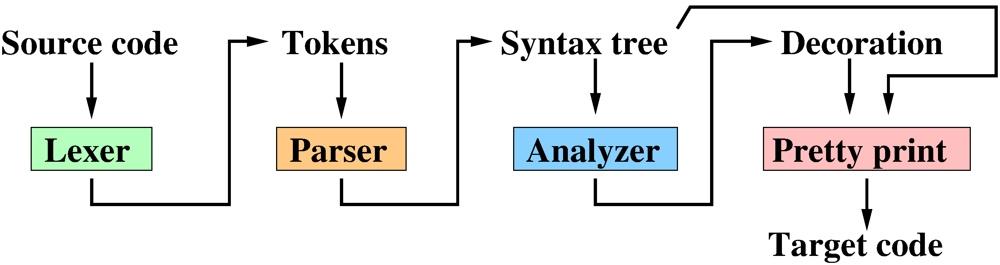
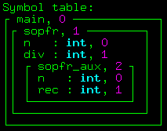

> 要求:
>
> - 编译器同样是重要的系统软件，它能够将我们编写的⾼级源代码转换成贴近底层的⽬标代码，本选课即为利⽤ Rust 实现⼀个简单语⾔的编译器。1> . 你可以⾃定义实现的语⾔，但它⾄少应该具有基本的数据类型、变量声明、函数声明、循环、条件判断等基本语法。
>
> -  实现的编译器⾄少应该具有语法分析和代码⽣成这两部分。
> -  在代码⽣成中，你可以选择基于 LLVM 的技术将源代码编译成⽬标⽂件，或者类似于 Java,Python 等语⾔的字节码并实现⼀个虚拟机来执⾏它。
> 
> - 参考资料：
> Compiler Book,
> Lox implementation in RustStanford Compiler Course

目标:实现简化版C语言(称为wend)的编译器,包含lexer/parser/analyzer/assembly generate四个主要的组件以及相关的数据结构(语法树、符号表、汇编生成模板)。


参考资料:

- Tiny Compiler ssloy.github.io/tinycompiler/ 一个用Python语言实现Wend编译器的教程
- How to Develop a Compiler (青木峰郎 著) 用Java实现Cb(也是一个简化版C语言)编译器的教程


How to run:
```
# 生成x86汇编 out.s
cargo run -- ./test-programs/example/example.wend 
# 运行
as --march=i386 --32 -o out.o out.s && ld -m elf_i386 out.o -o out && ./out
```


实现顺序: lexer & syntree -> parser -> analyzer(with symtable) -> asm_generate (with asm templetes) -> main


# 目标语言简介
Wend是一种结构化的、简化版的C语言，与C语言的主要区别如下：

1. **强制入口点**：程序的唯一入口必须是`main()`函数。程序所有内容定义在`main()`中，main外没有全局变量、函数等内容。
2. **嵌套函数**：函数内可以定义嵌套函数。所有函数必须定义在`main()`函数内部。允许函数递归和函数重载。
3. **严格顺序**：函数体内部必须按照 **局部变量声明 → 嵌套函数定义 → 可执行语句** 的顺序组织代码（类似于C89）。
4. **变量作用域规则**：每个函数(不包括子函数区域)对应一个作用域，局部变量在当前函数和子函数的作用域中有效。子函数在引用一个变量时，首先在自身作用域中查找，如果找不到再逐层向外查找。同一个作用域中不能定义重名变量,不同的作用域可以有重名变量。
5. **其他限制**：只有int和bool变量，以及int,bool和string三种字面量。系统提供print和println两个函数，能够打印int和string。流程控制仅支持if、else和while循环。

示例程序:
```
main() {
    int x;
    int y;
    int z;
    

    int min(int x, int y) {
        if x < y {
            return x;
        }
        return y;
    }
    // 重载函数
    int min(int x, int y, int z) {
        int temp;
        temp = min(x, y);  // 调用两参数版本
        if temp < z {
            return temp;
        }
        return z;
    }
    //递归版阶乘
    int factorial(int n) {
        if n > 1 {
            return n * factorial(n - 1);
        }
        return 1;
    }
    // 循环版阶乘
    int factorial_while(int x) {
        int result;
        int i;
        
        result = 1;
        i = 1;
        while i <= x {
            result = result * i;
            i = i + 1;
        }
        return result;
    }
    
    x = 10;
    y = 20;
    z = 5;
    
    println min(x, y);      // 调用两参数版本
    println min(x, y, z);   // 调用三参数版本
    println factorial(5);   // 调用递归版阶乘
    println factorial_while(5); // 调用循环版阶乘
}
```


详细内容见


# 词法分析 (Lexer)
Lexer本质上是一个状态机，把输入的字符串转化成一系列Tokens。

Token的定义是(token_type, value)。在编译器中，增加行号用于代码生成。

```rust
pub struct Token {
    pub token_type: String,
    pub value: String,
    pub lineno: usize,
}
```

按照下面这张图去实现即可


# Syntree
我们要定义一个语法树。例如,对于下面这个实现开根号的函数(这不是我们要实现的最终语言)

```c
fun main() {
    // square root of a fixed-point number
    // stored in a 32 bit integer variable, shift is the precision

    fun sqrt(n:int, shift:int) : int {
        var x:int;
        var x_old:int;
        var n_one:int;

        if n > 2147483647/shift { // pay attention to potential overflows
            return 2 * sqrt(n / 4, shift);
        }
        x = shift; // initial guess 1.0, can do better, but oh well
        n_one = n * shift; // need to compensate for fixp division
        while true {
            x_old = x;
            x = (x + n_one / x) / 2;
            if abs(x - x_old) <= 1 {
                return x;
            }
        }
    }

    fun abs(x:int) : int {
        if x < 0 {
            return -x;
        } else {
            return x;
        }
    }

    // 25735 is approximately equal to pi * 8192;
    // expected value of the output is sqrt(pi) * 8192 approx 14519

    println sqrt(25735, 8192);
}
```
它的语法树应该是


语法树是对程序的一种抽象，这种抽象与语言无关，因此我们通过解析一种语言得到语法树后，可以通过遍历语法树生成另一种语言的代码，包括汇编代码。


# 语法分析 (Parser)

Parser的作用是

- 判断一系列Token组成的语句是否符合语法规则
- 如果符合，则构建出相应的语法树

这里，我们使用一种实现简单、功能强大(支持任何上下文无关文法，包括歧义文法)的Earley Parser, 它能够很好地支持类似C语言的TYPE ID式声明。


Earley 解析器以输入位置为阶段进行工作。设输入词法单元序列为 $t_0 t_1 \ldots t_{n-1}$。对每个输入位置 $j \in [0 \ldots n]$，算法维护一个集合 $J_j$，其中的元素称为 Earley。 在任意 $J_j$ 中，相同的 Earley 项至多出现一次。

每个 Earley 项的形式为 $(A \to \alpha \bullet \beta,\ k)$。其中 $A \to \alpha\beta$ 是一条语法产生式，点 $\bullet$ 表示该产生式右侧中已经匹配完成的位置；$k$ 是该产生式开始匹配时的输入位置，即该非终结符 $A$ 被预测或引入时已处理的词法单元数量。


算法从集合 $J_0 = \{(S' \to \bullet S,\ 0)\}$ 开始，其中 $S$ 是语法的起始符号，$S'$ 是引入的人工起始符号。随后，算法按输入位置 $j = 0, 1, \ldots, n$ 依次构造各个集合 $J_j$。。


算法构造每个集合的流程如下:

- 遍历$J_j$的所有 Earley 项(遍历过程中,集合大小可能增长)

    - 若形如 $(A \to \alpha \bullet B\beta,\ k)$，其中 $B$ 是非终结符，则对每一条产生式 $B \to \gamma$，将项 $(B \to \bullet \gamma,\ j)$ 加入 $J_j$。该步骤称为预测（predict）。预测步骤可能会在$J_j$中添加新的Earley项，但应保证$J_j$作为集合的互异性(不会陷入无限循环)。

    - 若形如 $(A \to \alpha \bullet t\beta,\ k)$，其中 $t$ 是终结符，且 $t = t_j$，则将项 $(A \to \alpha t \bullet \beta,\ k)$ 加入 $J_{j+1}$。该步骤称为扫描（scan）。

    - 若为完成项 $(B \to \gamma \bullet,\ k)$，则对集合 $J_k$ 中的每一个项 $(A \to \alpha \bullet B\beta,\ l)$，将项 $(A \to \alpha B \bullet \beta,\ l)$ 加入 $J_j$。该步骤称为完成（complete）。


如果 $(S' \to S \bullet, 0)$ 存在于集合 $J_n$ 中，则算法成功解析了 $n$ 个输入词法单元的序列 $t_0t_1 \ldots t_{n-1}$，否则报告错误。

伪代码
```
DECLARE ARRAY S;

function INIT(words)
    S ← CREATE_ARRAY(LENGTH(words) + 1)
    for k ← from 0 to LENGTH(words) do
        S[k] ← EMPTY_ORDERED_SET

function EARLEY_PARSE(words, grammar)
    INIT(words)
    ADD_TO_SET((γ → •S, 0), S[0])
    for k ← from 0 to LENGTH(words) do
        for each state in S[k] do  // S[k] can expand during this loop
            if not FINISHED(state) then
                if NEXT_ELEMENT_OF(state) is a nonterminal then
                    PREDICTOR(state, k, grammar)         // non_terminal
                else do
                    SCANNER(state, k, words)             // terminal
            else do
                COMPLETER(state, k)
        end
    end
    return chart

procedure PREDICTOR((A → α•Bβ, j), k, grammar)
    for each (B → γ) in GRAMMAR_RULES_FOR(B, grammar) do
        ADD_TO_SET((B → •γ, k), S[k])
    end

procedure SCANNER((A → α•aβ, j), k, words)
    if j < LENGTH(words) and a ⊂ PARTS_OF_SPEECH(words[k]) then
        ADD_TO_SET((A → αa•β, j), S[k+1])
    end

procedure COMPLETER((B → γ•, x), k)
    for each (A → α•Bβ, j) in S[x] do
        ADD_TO_SET((A → αB•β, j), S[k])
    end
```

# 语义分析 (Analyzer)

## 符号表(SymbolTable)
python版本tinycompiler中的符号表设计
```python
class SymbolTable():
    def __init__(self):
        self.variables = [{}]     # stack of variable symbol tables
        self.functions = [{}]     # stack of function symbol tables
        self.ret_stack = [ None ] # stack of enclosing function symbols, useful for return statements
        self.scope_cnt = 0        # global scope counter for the display table allocation

    def add_fun(self, name, argtypes, deco):  # a function can be identified by its name and a list of argument types, e.g.
        signature = (name, *argtypes)         # fun foo(x:bool, y:int) : int {...} has ('foo',Type.BOOL,Type.INT) signature
        if signature in self.functions[-1]:
            raise Exception('Double declaration of the function %s %s' % (signature[0], signature[1:]))
        self.functions[-1][signature] = deco
        deco['scope'] = self.scope_cnt # id for the function block in the scope display table
        self.scope_cnt += 1

    def add_var(self, name, deco):
        if name in self.variables[-1]:
            raise Exception('Double declaration of the variable %s' % name)
        self.variables[-1][name] = deco
        deco['scope']  = self.ret_stack[-1]['scope']   # pointer to the display entry
        deco['offset'] = self.ret_stack[-1]['var_cnt'] # id of the variable in the corresponding stack frame
        self.ret_stack[-1]['var_cnt'] += 1

    def push_scope(self, deco):
        self.variables.append({})
        self.functions.append({})
        self.ret_stack.append(deco)
        deco['var_cnt'] = 0 # reset the per scope variable counter

    def pop_scope(self):
        self.variables.pop()
        self.functions.pop()
        self.ret_stack.pop()

    def find_var(self, name):
        for i in reversed(range(len(self.variables))):
            if name in self.variables[i]:
                return self.variables[i][name]
        raise Exception('No declaration for the variable %s' % name)

    def find_fun(self, name, argtypes):
        signature = (name, *argtypes)
        for i in reversed(range(len(self.functions))):
            if signature in self.functions[i]:
                return self.functions[i][signature]
        raise Exception('No declaration for the function %s' % signature[0], signature[1:])
```
SymbolTable实际上是一个符号表的栈，每个作用域有各自的符号表，包括变量的符号表和函数的符号表。

我们实现的语言约定下面的语法：
fun →
    fun_type ID '(' param_list ')' '{'
        var_list
        fun_list
        statement_list
    '}'
即，在一个函数中，必须先声明所有的局部变量，然后声明所有的嵌套函数，最后才能开始写具体的语句。这会为parser个analyzer带来极大的便利。
我们为每一个scope(作用域)分配了id。这些声明的变量与函数参数共同构成了属于这个作用域的变量，它们都有各自的变量id，如下图所示。




我们记录下每个scope的帧基址，这样，我们只需要一个scope_id加一个var_id即可确定一个变量,即：变量地址 = scope_id帧的基地址 - 偏移量(var_id * 4)


语义分析器借助符号表，对AST进行检查，确认AST中节点变量/函数的合法性，确保没有变量和函数的未定义、重复定义等问题。如果没有问题，则能够认为代码已经“通过检查”。

语义分析器同时会对AST节点添加scope_id,var_id,var_cnt等信息,便于下一步生成汇编代码。

## 显示表(Display)的作用与构建
Display是一个全局数组，在汇编中被声明在 .data 段。其大小为作用域的总数量scope_cnt, 在语义分析的阶段确定。
Display[scope_id]存放的就是该作用域当前活动代码的帧基址，当scope_id所对应的函数发生对其他函数的调用与返回时，Display[scope_id]会被修改和恢复，以正确定位所需的局部变量。详见下一部分的“函数调用的汇编生成”。


# 汇编生成 (asm_generate)

这一部分的作用是把经过语义分析装饰后的语法树生成汇编代码。

## 表达式的汇编生成

> GNU汇编的基本格式:
> ```
> op src,dst
> ```
我们使用简单的GNU x86汇编，规定函数的返回值和表达式的结果(即AST的结点值)都存储在eax寄存器中。我们希望找到一种简单、通用的表达式计算方法，**只用eax,ebx两个寄存器和一个堆栈**

使用简单的栈机模型进行二元表达式(a op b)计算：
```
1. 计算左表达式a->%eax
2. push %eax
3. 计算右表达式b->%eax
4. mov %eax, %ebx
5. pop %eax
6. op %ebx, %eax
```
对于所有表达式操作，都可以用上面的方式构造一个“汇编模板”。
通过对语法树进行深度优先遍历并展开对每个表达式的汇编模板，即可生成函数体部分的所有汇编代码。
例如，对于表达式a + 2 * b,可以将其转换成下列汇编代码
```
move a to %eax                            \
push(%eax)                                |
move 2 to %eax      \                     |
push(%eax)           |                    |
move b to %eax       | 2*b saved in %eax  | a + 2*b saved in %eax
move %eax to %ebx    |                    |
%eax = pop()         |                    |
%eax = %eax * %ebx  /                     |
move %eax to %ebx                         |
%eax = pop()                              |
%eax = %eax + %ebx                        /
```


## 函数调用的汇编生成

接下来，我们考虑如何生成函数调用的汇编。

函数调用实际上隐含下面的流程
```
def foo():
  global display,stack,eax
  stack += [None]*nlocals                     # 在栈中留出局部变量的空间
  stack += [display[scope]]                   # 保存调用者的帧指针
  display[scope] = len(stack)-nlocals-nargs-1 # 设置当前函数的帧指针

  ...                                         # 函数体，平常我们只需要写这一部分

  display[scope] = stack.pop()                # 恢复调用者的帧指针
  eax = ...                                   # 当前函数的返回值存入eax
  if nlocals>0:                               # 移除栈中当前函数的局部变量
    del stack[-nlocals:]
```

同样的，我们可以将函数调用的流程写为汇编模板，进行整体替换

## 汇编生成的总体流程

```
def asm_generate(n):
    # 生成所有字符串常量的汇编代码：遍历语法树节点中的字符串常量表，
    # 对每个(label, string)对使用'ascii'模板进行格式化，然后拼接成完整字符串段
    strings = ''.join([templates['ascii'].format(label=label, string=string) for label,string in n.deco['strings']])
    
    # 计算显示表(display)的总大小：scope_cnt表示作用域数量，每个作用域指针占4字节
    display_size = n.deco['scope_cnt']*4
    
    # 计算当前作用域在display表中的偏移量：scope表示当前作用域编号，乘以4得到在display数组中的字节偏移量
    offset       = n.deco['scope']*4
    
    # 获取主函数的标签名：从语法树节点中提取主函数的符号标签
    main         = n.deco['label']
    
    # 计算局部变量所需的空间大小
    varsize      = len(n.var)*4
    
    # 递归生成所有函数的汇编代码：调用fun函数处理语法树中的函数定义，生成函数体的汇编代码
    functions    = fun(n)
    
    # 使用'program'模板生成完整的汇编程序：将前面计算的所有变传递给模板进行格式化，返回最终的汇编代码字符串
    return templates['program'].format(
    strings=strings,
    display_size=display_size,
    offset=offset,
    main=main,
    varsize=varsize,
    functions=functions
)
```


