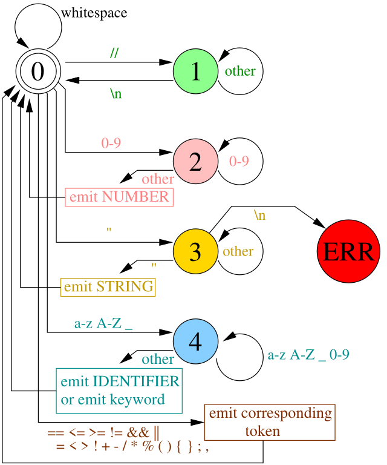
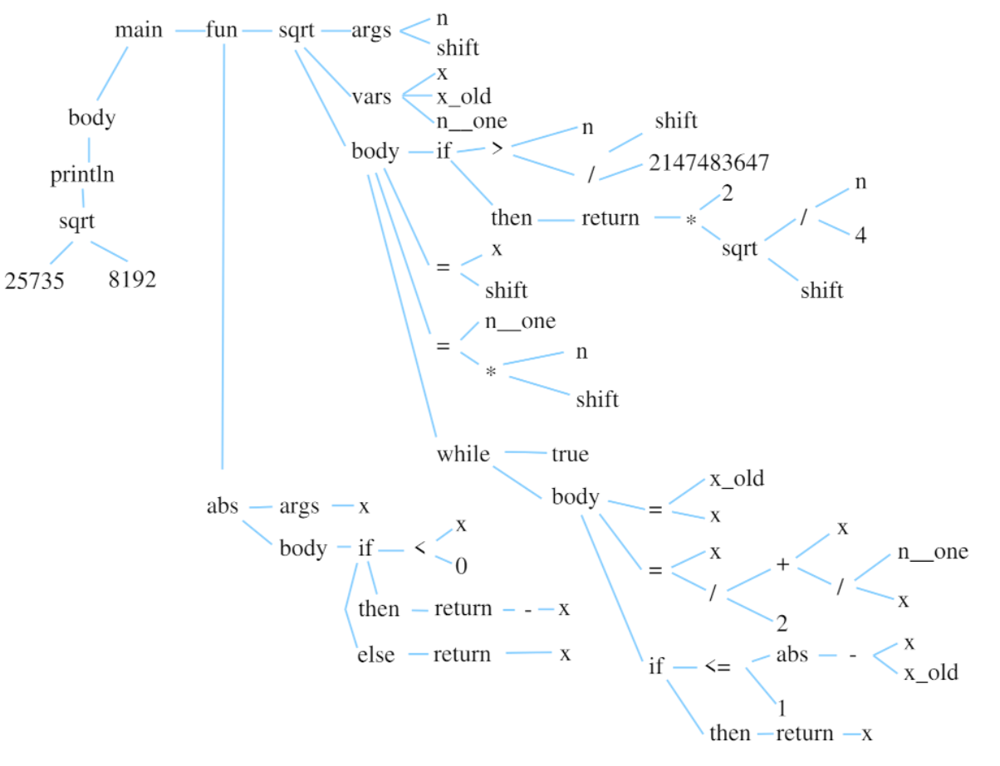

实现顺序总结表

顺序	文件	行数	依赖	难度

1️⃣	syntree.rs	~100	无	⭐ 简单

2️⃣	lexer.rs	~150	无	⭐⭐ 中等

3️⃣	parser.rs	~200	lexer, syntree	⭐⭐⭐ 困难

4️⃣	symtable.rs	~100	syntree	⭐⭐ 中等

5️⃣	analyzer.rs	~150	syntree, symtable	⭐⭐ 中等

6️⃣	transasm_recipe.rs	~100	无	⭐ 简单

7️⃣	transasm.rs	~150	syntree, transasm_recipe	⭐⭐⭐ 困难

8️⃣	main.rs	~50	所有	⭐ 简单


# Lexer
Lexer本质上是一个状态机，按照下面这张图去实现即可


# Syntree
我们要定义一个语法树,例如,对于下面这个实现开根号的函数
```c
fun main() {
    // square root of a fixed-point number
    // stored in a 32 bit integer variable, shift is the precision

    fun sqrt(n:int, shift:int) : int {
        var x:int;
        var x_old:int;
        var n_one:int;

        if n > 2147483647/shift { // pay attention to potential overflows
            return 2 * sqrt(n / 4, shift);
        }
        x = shift; // initial guess 1.0, can do better, but oh well
        n_one = n * shift; // need to compensate for fixp division
        while true {
            x_old = x;
            x = (x + n_one / x) / 2;
            if abs(x - x_old) <= 1 {
                return x;
            }
        }
    }

    fun abs(x:int) : int {
        if x < 0 {
            return -x;
        } else {
            return x;
        }
    }

    // 25735 is approximately equal to pi * 8192;
    // expected value of the output is sqrt(pi) * 8192 approx 14519

    println sqrt(25735, 8192);
}
```
它的语法树应该是


