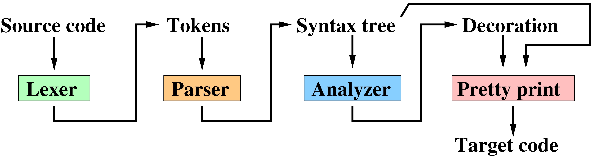
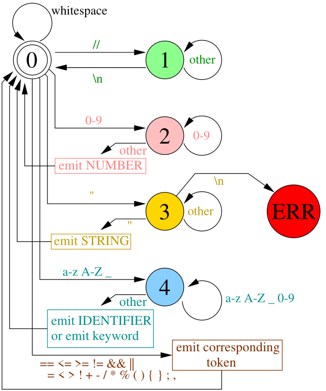
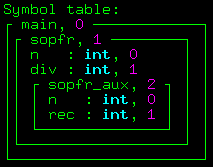

# TinyCompiler By Rust  
——Rust 实现的极简编译器  

---

## 目录  

1. [项目简介](#项目简介)  
2. [基础组件](#基础组件)  
3. [语义分析](#语义分析)  
4. [汇编生成](#汇编生成)  
5. [测试](#测试)  
6. [总结](#总结)  

---

## How to run

```
xxx# cargo run -- ./test-programs/simple/eight-queens.wend

Assembly code generated in out.s! Please run it by the following command:
as --march=i386 --32 -o out.o out.s && ld -m elf_i386 out.o -o out && ./out

xxx# as --march=i386 --32 -o out.o out.s && ld -m elf_i386 out.o -o out && ./out

Q.......
......Q.
....Q...
.......Q
.Q......
...Q....
.....Q..
..Q.....
```

## 项目简介  

### 参考项目：  

- **TinyCompiler** https://github.com/ssloy/tinycompiler  
  - 一个使用 Python 编写的极简编译器，总行数约 500 行  
  - 没有依赖任何 Python 第三方库，实现从源代码（Wend，一种语法与 C 类似的简单语言）到生成 32 位 GNU 汇编的完整流程  
    - 包含词法分析、语法分析、语义分析、汇编生成等主要模块  
    - 作者编写了循序渐进、有趣的教程，即使没有学过编译原理的人也能理解  

### 项目目标：  

- 使用 Rust 语言复现 TinyCompiler 的所有功能，如有时间，拓展更多功能  
- 学习基础的编译原理、Rust 语言，以及如何利用 LLM 编写逻辑复杂的代码并调试  

### 基本结构  

**组件：**  
1. Lexer  
2. Parser  
3. Analyzer  
4. Asm_Generator  

**数据流：**  
源码 → Tokens → AST → 带作用域信息的 AST → 汇编  


```rust
let src = fs::read_to_string(src_path).unwrap();

mod syntree;
mod lexer;
mod parser;
mod analyzer;
mod asm_generate;

// 1. Lexer: Transform source code into tokens
let lexer = WendLexer::new();
let tokens = lexer.tokenize(&src).unwrap();

// 2. Parser: Transform tokens into AST according to given grammar
let parser = WendParser::new();
let mut ast = parser.parse(tokens).unwrap();

// 3. Analyzer: Analyze variables and functions and decorate AST node accordingly
decorate(&mut ast);

// 4. Assembly Generator: Generate assembly code from decorated AST
let asm_code = asm_generate(&ast);
fs::write("out.s", asm_code).unwrap();

println!(
    "Assembly code generated in out.s! Please run it by the following command: \
    as --march=i386 --32 -o out.o out.s && ld -m elf_i386 out.o -o out && ./out"
);
```

### 目标语言 Wend 简介  

Wend 语言的基本语法与 C 语言相似，关键区别如下：  

> **强制入口**：程序的唯一入口必须是 `main()` 函数。所有函数和变量必须定义在 `main()` 内部。  

> **嵌套函数**：函数内可以定义子函数（所有自定义函数都是 `main()` 的子函数）。允许函数递归和函数重载。  

> **严格顺序**：函数必须按照 **局部变量声明 → 子函数定义 → 可执行语句** 的顺序组织代码（每部分均可为空）。  

> **变量作用域规则**：  
> - 每个函数对应一个作用域，函数的局部变量作用于该作用域（`main` 的局部变量相当于全局变量）  
> - 子函数在引用一个变量时，首先在自身作用域中查找，如果找不到再逐层向外查找  
> - 同一个作用域中不能定义重名变量，不同的作用域的变量可以重名  

> **其他限制**：  
> - 只有 `int` 和 `bool` 变量，以及 `int`、`bool` 和 `string` 三种字面量。没有数组和浮点数  
> - 提供 `print` 和 `println` 语句，能够打印 `int`、`bool` 和 `string`  
> - 流程控制仅支持 `if`、`else` 和 `while` 循环  

### 示例程序  

```c
main() {
    int x; int y; int z;

    int min(int x, int y) { // 两个数min
        if x < y { return x; }
        return y;
    }

    int min(int x, int y, int z) {
        int temp; // 三个数min
        temp = min(x, y);
        if temp < z { return temp; }
        return z;
    }

    int factorial(int n) { // 递归版阶乘
        if n > 1 { return n * factorial(n - 1); }
        return 1;
    }

    int factorial_while(int x) { // 循环版阶乘
        int result; int i;
        result = 1; i = 1;
        while i <= x {
            result = result * i;
            i = i + 1;
        }
        return result;
    }

    x = 10; y = 20; z = 5;
    println min(x, y); // 调用两参数版本
    println min(x, y, z); // 调用三参数版本
    println factorial(5); // 调用递归版阶乘
    println factorial_while(5); // 调用循环版阶乘
}
```

**运行结果：**  
```
10
5
120
120
```

---

## 基础组件  

### 数据结构（变量、表达式、语句、函数、AST 节点、装饰字典）  

```rust
pub struct Var {
    pub name: String,
    pub deco: Deco,
}

pub struct LogicOp {
    pub op: String,
    pub left: Box<Expr>,
    pub right: Box<Expr>,
    pub deco: Deco,
}

pub enum Expr {
    ArithOp(ArithOp),
    LogicOp(LogicOp),
    Integer(Integer),
    Boolean(Boolean),
    StringLit(StringLit),
    Var(Var),
    FunCall(FunCall),
}

pub enum Stmt {
    Print(Print),
    Return(Return),
    Assign(Assign),
    While(While),
    IfThenElse(IfThenElse),
    FunCall(FunCall),
}

pub struct Function {
    pub name: String,
    pub args: Vec<Var>,
    pub var: Vec<Var>,
    pub fun: Vec<Function>,
    pub body: Vec<Stmt>,
    pub deco: Deco,
}

pub enum DecoValue {
    Int(i64),
    Bool(bool),
    Str(String),
    Ty(Type),
    StringSet(HashSet<String>),
}

pub type Deco = HashMap<String, DecoValue>;
```

### Lexer（词法分析）  

词法分析器负责将源代码转换为 Token 序列。通过状态机实现。  



### Parser（语法分析）  

**语法分析的任务：**  
- 判断一系列 Token 组成的变量、语句和函数是否符合语法规则  
- 如果符合，则构建出相应的语法树  

**Wend 语言的语法规则：共 49 条**  
- 例1：变量声明：`TYPE ID`（如 `int x`）  
  `Rule { lhs: "var", rhs: &["TYPE", "ID"] }`  
- 例2：参数列表：  
  ```rust
  Rule { lhs: "param_list", rhs: &["var"] },
  Rule { lhs: "param_list", rhs: &[] },
  Rule { lhs: "param_list", rhs: &["param_list", "COMMA", "var"] },
  ```  
- 例3：函数声明：  
  ```rust
  Rule { lhs: "fun", rhs: &["fun_type", "ID", "LPAREN", "param_list", "RPAREN", "BEGIN", "var_list", "fun_list", "statement_list", "END"] },
  ```

**运算优先级的实现：**  
- 把不同优先级的运算拆成不同非终结符，分层解析  
- 从低到高：`expr → conjunction → literal → comparand → addend → term → factor → atom`  
- 语法规则中，上层只能组合下层，从而保证优先级顺序  
- 最低优先级：`||`（在 `expr` 层）  
- `&&`（在 `conjunction` 层）  
- `!`（在 `literal` 层）  
- 比较运算 `== != < <=` 等在 `comparand` 层  
- 加减在 `addend` 层  
- 乘除、取模在 `term` 层  
- 一元 `+ / -` 在 `factor` 层  
- 括号与变量同属 `atom` 层，可以将一个表达式强行变成 `atom`（`atom → "(" ID ")"`），实现最高优先级  

**Earley Parser：**  
- 优点：简单，支持任意上下文无关文法，可以直接解析 C 风格的语法（如 `TYPE ID` 定义变量）  
- 缺点：效率较低，最坏时间复杂度为 O(N³)  
- 解析时记录推导历史（`prev` 指针），通过沿 `prev` 回溯并按产生式顺序归约，可直接在归约过程中构造 AST  


Earley 解析器以输入位置为阶段进行工作。设输入词法单元序列为 $t_0 t_1 \ldots t_{n-1}$。对每个输入位置 $j \in [0 \ldots n]$，算法维护一个集合 $J_j$，其中的元素称为 Earley。 在任意 $J_j$ 中，相同的 Earley 项至多出现一次。

每个 Earley 项的形式为 $(A \to \alpha \bullet \beta,\ k)$。其中 $A \to \alpha\beta$ 是一条语法产生式，点 $\bullet$ 表示该产生式右侧中已经匹配完成的位置；$k$ 是该产生式开始匹配时的输入位置，即该非终结符 $A$ 被预测或引入时已处理的词法单元数量。


算法从集合 $J_0 = \{(S' \to \bullet S,\ 0)\}$ 开始，其中 $S$ 是语法的起始符号，$S'$ 是引入的人工起始符号。随后，算法按输入位置 $j = 0, 1, \ldots, n$ 依次构造各个集合 $J_j$。。


算法构造每个集合的流程如下:

- 遍历$J_j$的所有 Earley 项(遍历过程中,集合大小可能增长)

    - 若形如 $(A \to \alpha \bullet B\beta,\ k)$，其中 $B$ 是非终结符，则对每一条产生式 $B \to \gamma$，将项 $(B \to \bullet \gamma,\ j)$ 加入 $J_j$。该步骤称为预测（predict）。预测步骤可能会在$J_j$中添加新的Earley项，但应保证$J_j$作为集合的互异性(不会陷入无限循环)。

    - 若形如 $(A \to \alpha \bullet t\beta,\ k)$，其中 $t$ 是终结符，且 $t = t_j$，则将项 $(A \to \alpha t \bullet \beta,\ k)$ 加入 $J_{j+1}$。该步骤称为扫描（scan）。

    - 若为完成项 $(B \to \gamma \bullet,\ k)$，则对集合 $J_k$ 中的每一个项 $(A \to \alpha \bullet B\beta,\ l)$，将项 $(A \to \alpha B \bullet \beta,\ l)$ 加入 $J_j$。该步骤称为完成（complete）。


如果 $(S' \to S \bullet, 0)$ 存在于集合 $J_n$ 中，则算法成功解析了 $n$ 个输入词法单元的序列 $t_0t_1 \ldots t_{n-1}$，否则报告错误。

伪代码
```
DECLARE ARRAY S;

function INIT(words)
    S ← CREATE_ARRAY(LENGTH(words) + 1)
    for k ← from 0 to LENGTH(words) do
        S[k] ← EMPTY_ORDERED_SET

function EARLEY_PARSE(words, grammar)
    INIT(words)
    ADD_TO_SET((γ → •S, 0), S[0])
    for k ← from 0 to LENGTH(words) do
        for each state in S[k] do  // S[k] can expand during this loop
            if not FINISHED(state) then
                if NEXT_ELEMENT_OF(state) is a nonterminal then
                    PREDICTOR(state, k, grammar)         // non_terminal
                else do
                    SCANNER(state, k, words)             // terminal
            else do
                COMPLETER(state, k)
        end
    end
    return chart

procedure PREDICTOR((A → α•Bβ, j), k, grammar)
    for each (B → γ) in GRAMMAR_RULES_FOR(B, grammar) do
        ADD_TO_SET((B → •γ, k), S[k])
    end

procedure SCANNER((A → α•aβ, j), k, words)
    if j < LENGTH(words) and a ⊂ PARTS_OF_SPEECH(words[k]) then
        ADD_TO_SET((A → αa•β, j), S[k+1])
    end

procedure COMPLETER((B → γ•, x), k)
    for each (A → α•Bβ, j) in S[x] do
        ADD_TO_SET((A → αB•β, j), S[k])
    end
```


---

## 语义分析  

### 符号表（Symbol Table）与作用域分析 



- 每个作用域（scope）都有 `scope_id`、`var_cnt`、变量表和函数表。每个变量有 `var_id`  
- 遍历 AST 时，用栈维护全局符号表（实现 `add_var`、`push_scope`、`pop_scope`、`find_var` 操作）  
- `find_var` 操作将分析出当前 AST 节点符号实际的 `scope_id` 和 `var_id`，将其添加到 AST 节点的 `Deco`（装饰信息）中  

### 作用域分析与 Display 数组构建  

- 变量的地址可由 `Deco` 中的 `scope_id` 和 `var_id` 确定：  
  `var_addr = Display[scope_id] - var_id * 4`  
- `Display` 数组存放每个作用域（函数）的帧基址，位于汇编代码的 `.data` 段  
- 其大小为作用域的总数量，在编译器维护符号表的过程中确定  
- 在函数被调用时，对应的 `display[scope_id]` 被更新为当前函数栈帧地址  
- 在函数返回时，`display[scope_id]` 恢复为调用前的值  

---

## 汇编生成  

### 表达式的汇编生成  

- GNU 汇编中二元表达式的基本格式：`OP SRC, DST`，如 `add %ebx, %eax`  
- 使用简单的栈机模型计算复合表达式，仅使用 `eax`、`ebx`、运行时栈（`push`、`pop`）和 `.data` 区  
- 约定返回值（结果）存放于 `eax`  
- 复合二元表达式计算模板：  
  1. 计算左表达式 `a → %eax`  
  2. `push %eax`  
  3. 计算右表达式 `b → %eax`  
  4. `mov %eax, %ebx`  
  5. `pop %eax`  
  6. `op %ebx, %eax`  

例如，对于表达式 `a + 2 * b`，在深度优先遍历 AST 的过程中展开汇编模板即可。  

```
move a to %eax                            \
push(%eax)                                |
move 2 to %eax      \                     |
push(%eax)           |                    |
move b to %eax       | 2*b saved in %eax  | a + 2*b saved in %eax
move %eax to %ebx    |                    |
%eax = pop()         |                    |
%eax = %eax * %ebx  /                     |
move %eax to %ebx                         |
%eax = pop()                              |
%eax = %eax + %ebx                        /
```


### 语句和函数的汇编生成  

- 语句的汇编生成：为每一种语句（赋值、判断、循环、函数调用等）定义汇编模板，编写对应的 Rust 函数，填入信息生成汇编  
- `print` 函数在 parser 中被解析为语句，其汇编模板通过 `syscall` 实现打印功能  
- 函数的汇编生成：  
  1. 递归生成所有嵌套函数的汇编代码  
  2. 生成当前函数体内所有语句的汇编代码  
  3. 按“函数标签 → 函数体 → ret 指令 → 嵌套函数代码”的顺序拼接  

```rust
fn gen_fun(n: &Function) -> String {
    let label = get_s(&n.deco, "label");
    let mut nested = String::new();
    for f in &n.fun {
        nested.push_str(&gen_fun(f));
    }
    let mut body = String::new();
    for s in &n.body {
        body.push_str(&gen_stmt(s));
    }
    format!("{label}:\n{body}\nret\n{nested}\n")
}
```

### 函数调用语句的汇编生成  

函数调用隐含保存现场和返回的流程。下面的Python代码展示了这个流程，FunCall汇编模板实现同样的流程。

```
def foo():
  global display,stack,eax
  stack += [None]*nlocals                     # 在栈中留出局部变量的空间
  stack += [display[scope]]                   # 保存调用者的帧指针
  display[scope] = len(stack)-nlocals-nargs-1 # 设置当前函数的帧指针

  ...                                         # 函数体，平常我们只需要写这一部分

  display[scope] = stack.pop()                # 恢复调用者的帧指针
  eax = ...                                   # 当前函数的返回值存入eax
  if nlocals>0:                               # 移除栈中当前函数的局部变量
    del stack[-nlocals:]
```


汇编模板需传入作用域相关参数，如 `var_cnt`、`scope_id` 等。  

```rust
fn gen_fun_call(n: &FunCall) -> String {
    let mut allocargs = String::new();
    for a in &n.args {
        allocargs.push_str(&gen_expr(a));
        allocargs.push_str("\tpushl %eax\n");
    }
    let var_cnt = get_i(&n.deco, "var_cnt");
    let varsize = var_cnt * 4;
    let disphead = var_cnt * 4 + (n.args.len() as i32) * 4 - 4;
    let scope = get_i(&n.deco, "scope") * 4;
    let funlabel = get_s(&n.deco, "label");
    render(TEMPLATES.funcall, &[
        ("allocargs", allocargs),
        ("varsize", varsize.to_string()),
        ("disphead", disphead.to_string()),
        ("scope", scope.to_string()),
        ("funlabel", funlabel),
    ])
}
```

### 总体流程  

```rust
fn render(template: &str, items: &[(&str, String)]) -> String {
    let mut s = template.to_string();
    for (k, v) in items {
        s = s.replace(&format!("{{{{{}}}}}", k), &v);
    }
    s
}

pub fn asm_generate(main_fun: &Function) -> String {
    let mut strings_asm = String::new();
    let strings = get_stringset(&main_fun.deco, "strings");
    for (label, string) in strings {
        strings_asm.push_str(&render(TEMPLATES.ascii, &[("label", label), ("string", escape_ascii(&string))]));
    }
    let display_size = get_i(&main_fun.deco, "scope_cnt") * 4;
    let offset = get_i(&main_fun.deco, "scope") * 4;
    let main_label = get_s(&main_fun.deco, "label");
    let varsize = (main_fun.var.len() as i32) * 4;
    let functions = gen_fun(main_fun);
    render(TEMPLATES.program, &[
        ("strings", strings_asm),
        ("display_size", display_size.to_string()),
        ("offset", offset.to_string()),
        ("main", main_label),
        ("varsize", varsize.to_string()),
        ("functions", functions),
    ])
}
```

---

## 测试  

- TinyCompiler 原作者提供了许多有趣的 Wend 程序，可用于测试编译器的正确性  
- 例如 `eight-queens.wend` 实现了通过深度优先搜索求解八皇后问题  
- TinyCompiler By Rust 能够为这些程序生成正确的汇编代码，并给出预期结果  

**示例测试：**  
```
xxx# cargo run -- ./test-programs/simple/eight-queens.wend

Assembly code generated in out.s! Please run it by the following command:
as --march=i386 --32 -o out.o out.s && ld -m elf_i386 out.o -o out && ./out

xxx# as --march=i386 --32 -o out.o out.s && ld -m elf_i386 out.o -o out && ./out

Q.......
......Q.
....Q...
.......Q
.Q......
...Q....
.....Q..
..Q.....
```

---

## 总结  

- 本项目通过对 TinyCompiler 的学习和 Rust 重写，掌握了 Rust 语言的基本知识与开发流程，同时对编译原理有了更深入的理解  
- 本项目的大部分代码由 ChatGPT 生成。面对逻辑复杂的编译器项目，LLM 无法一次生成正确的代码，需在理解原理的基础上，通过不断调试和修改完成  
- Rust 的安全性保证了一旦程序通过编译，基本不会出现难以排查的内存错误  

**局限性与未来工作：**  
- 部分实现效率较低，例如为避免借用关系报错，很多地方使用了不必要的 `clone`  
- `Deco` 在设计上强行模仿 Python 版本，由于 Rust 规范更严格，一些操作需要大量代码才能实现，未来可用更好的设计替代  
- 当前编译器只实现了非常基础的功能，未来可考虑拓展浮点数、数组、编译优化等功能  

---  

